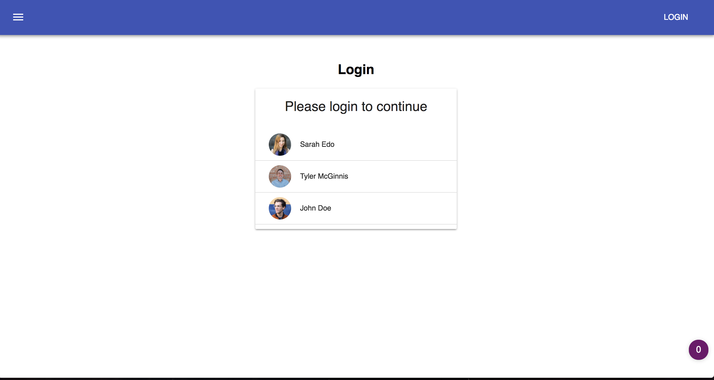
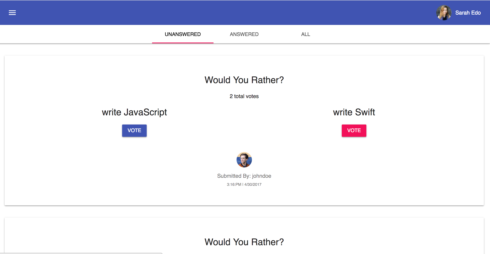
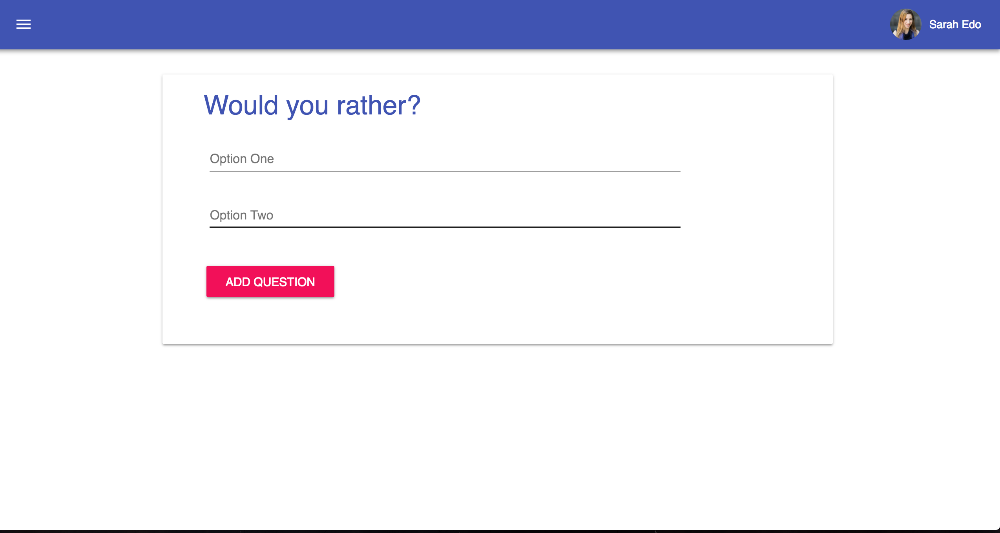
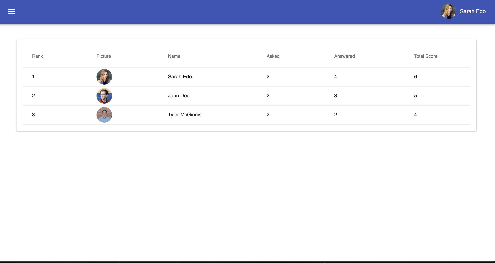

# Would You Rather?






## Getting Started

To get started developing right away:

```
git clone https://github.com/drownedout/react-nd-my-reads.git
npm install
npm start
```
The app will open in a new browser tab using localhost:3000

## What You're Getting
```bash
├── CONTRIBUTING.md
├── README.md - This file.
├── package.json # npm package manager file.
├── public
│   ├── favicon.icon
│   └── index.html # DO NOT MODIFY
└── src
    ├── App.css # Styles for the app.
    ├── App.js # This is the root of the app.
    ├── App.test.js # Used for testing. Provided with Create React App. Testing is encouraged, but not required.
    ├── index.css # Global styles.
    ├── index.js # Used for DOM rendering only.
    ├── actions # Source of each actions to be dispatched to the reducers
    ├── components
    ├── middlewares
    ├── reducers # Take in actions to modify app state
    └── utils # Data and helper functions
```

## Create React App

This project was bootstrapped with [Create React App](https://github.com/facebookincubator/create-react-app). You can find more information on how to perform common tasks [here](https://github.com/facebookincubator/create-react-app/blob/master/packages/react-scripts/template/README.md).
